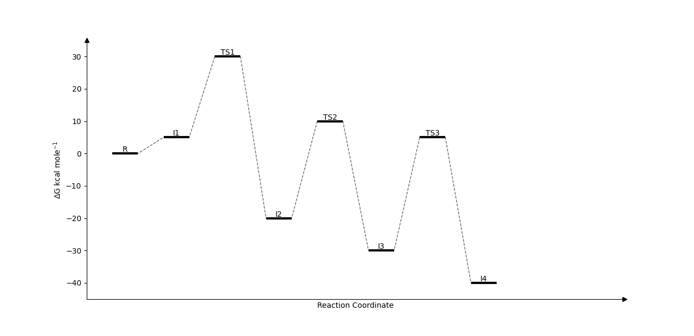

Simple Python script to automate the drawing of a reacion profile.

Example Usage:
```
import path

labels = ["R","I1","TS1","I2","TS2","I3","TS3","I4","P"]
energies = [0.0, 5.0, 30.0, -20.0, 10.0, -30.0, 5.0, -40.0]

path.plot_reaction_profile(energies=energies, labels=labels)

```

Example Output:


All Current Options:
```
def plot_reaction_profile(energies, labels=None, energy_buffer=5.0):
```
- energies: List of energies
- labels: List of labels (Default=None)
- energy_buffer: How much space to give above and below reaction profile i.e. setting y-limits.

Requires Matplotlib.