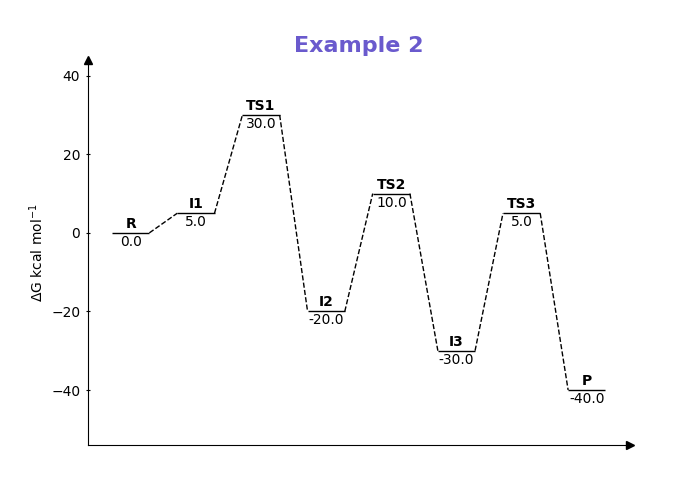

## ReactionPath
A simple Python script to automate the drawing of a reaction profile.

Requires Matplotlib.

### Example Inputs
```
import path

labels = ["R","I1","TS1","I2","TS2","I3","TS3","P"]
energies = [0.0, 5.0, 30.0, -20.0, 10.0, -30.0, 5.0, -40.0]

path.plot_reaction_profile(energies, labels=labels, title="Example 1")
path.plot_reaction_profile(energies, labels=labels, point_width=2.5, 
                           point_distance=4.0, point_linewidth=1.5, connector_linewidth=0.5, title="Example 2")

```

### Example Outputs:




### Options
```
def plot_reaction_profile(energies, labels=None, label_offset=0.5, title=None, 
                          point_width=0.25, point_distance=0.5, x_margin=0.05, y_margin=0.05,
                          point_linewidth=3, connector_linewidth=1):
```

| Argument            | Explanation                                      |
|---------------------|--------------------------------------------------|
| energies            | List of energies                                 |
| labels              | List of labels                                   |
| label_offset        | How much to offset labels from point             |
| title               | Title of plot                                    |
| point_width         | Width of stationary point horizontal line        |
| point_distance      | Distance between stationary points               |
| x_margin            | How much margin to put on left and right of plot |
| y_margin            | How much margin to put on top and bottom of plot |
| point_linewidth     | Linewidth of stationary point horizontal line    |
| connector_linewidth | Linewidth of dashed connector lines              |
