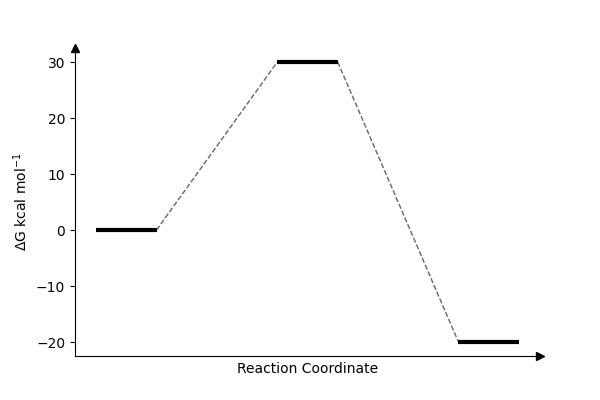

## ReactionPath
A simple Python script to automate the drawing of a reaction profile.

Requires Matplotlib.

### Options
```
def plot_reaction_profile(energies, labels=None, label_offset=0.5, title=None, 
                          point_width=0.25, point_distance=0.5, x_margin=0.05, y_margin=0.05,
                          point_linewidth=3, connector_linewidth=1):
```

### Example Inputs
```
import path

labels = ["R","I1","TS1","I2","TS2","I3","TS3","I4","P"]
energies = [0.0, 5.0, 30.0, -20.0, 10.0, -30.0, 5.0, -40.0]

path.plot_reaction_profile(energies, labels=labels, title="Example 1")
path.plot_reaction_profile(energies, labels=labels, point_width=1.0, title="Example 2")
path.plot_reaction_profile(energies, labels=labels, point_width=1.0, point_distance=3.0, title="Example 3")
path.plot_reaction_profile(energies, labels=labels, point_linewidth=1, connector_linewidth=0.5, title="Example 4")

```

### Example Outputs:



